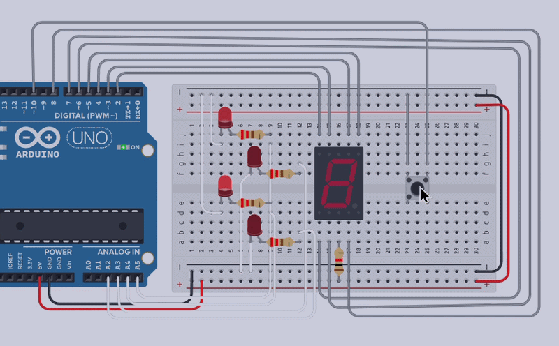

# 🎲 Digital Dice

  A simple digital dice project built with Arduino and a 7-segment display.

## ✨ Overview
This project simulates a real dice using a 7-segment display.
When the button is pressed, the circuit generates a random number between **1 and 6** and displays the result.

## 🛠️ Components

* Arduino
* 7-Segment Display (common cathode type is used in this project :) )
* Push Button
* Resistors

## ❓ How It Works
1. Press the button.
2. Arduino generates a random number from **1 to 6**.
3. The corresponding number is displayed on the 7-segment display.
4. Press the button again to roll the dice again.

## 📼 Demo

  

## 🔗 Tinkercad

  

> *(https://www.tinkercad.com/things/4r3ikkPLNBz-digital-dice-with-7-segment)*

## 💻 Source Code

`scr.ino`
