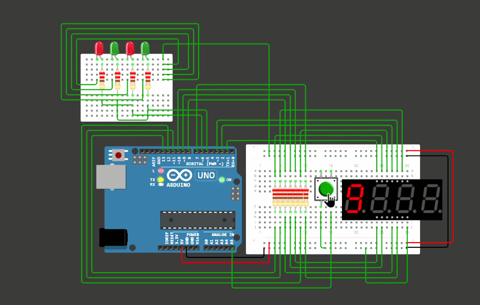

# 🎰 Jackpot Game

  A simple Arduino-based jackpot game using a 4-digit 7-segment display.

## ✨ Overview
This project is a small jackpot-style game built with Arduino and a 4-digit 7-segment display.
When the button is pressed, the numbers on the display cycle through different values and eventually stop at a final result. The player then wins or loses depending on the generated combination.

## 🛠️ Components

* Arduino
* 4-Digit 7-Segment Display
* Push Button
* LEDs
* Resistors

## ❓ How It Works
1. Press the button to start the game.
2. The numbers on the 7-segment display start changing.
3. The display stops at a final combination.
4. Arduino checks the result.
5. The corresponding win or lose state is shown using the LEDs.

## 📼 Demo

  

## 🔗 wokwi simulation

  

> *(https://wokwi.com/projects/472585412584011777)*

## 💻 Source Code

`scr.ino`
